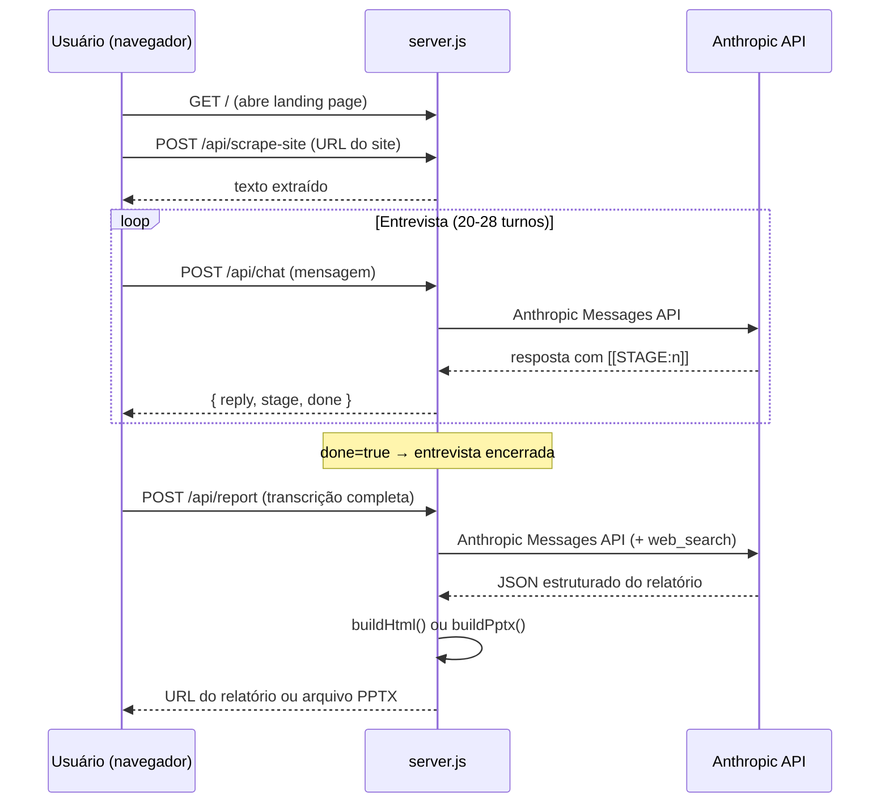

# Auditoria IA App

Aplicação web que conduz uma **entrevista de diagnóstico empresarial por chat** (com IA real via API da Anthropic) e, ao final, gera automaticamente um **relatório de oportunidades de crescimento** — entregue como página HTML interativa ou deck PPTX.

O público-alvo são fabricantes e transformadoras de veículos (motorhome, ambulância, implementos rodoviários, reboque, semirreboque, encarroçamento e afins), mas a estrutura de entrevista + relatório pode ser adaptada a qualquer segmento.

---

## Últimas Atualizações (Setembro/2026)
- **Rebranding:** Substituição de `DeskcommCRM` por `Growthnow` em todo o código e templates gerados.
- **Auditoria Otimizada:** Ajuste no escopo da entrevista (Ana) para focar estritamente em **comercial, margem/financeiro e pós-venda**, removendo engenharia e produção do escopo.
- **Custo de Não Agir Direto e Sem Rodeios:** Unificação da pergunta do Bloco 3 na entrevista e substituição da evolução temporal (1-3m, 6-12m, 1-3a) no relatório por 3 dimensões diretas de impacto no negócio (*No Caixa e Vendas*, *Na Operação e Tempo*, *No Crescimento e Mercado*).
- **Copy da Landing Page:** Atualização da comunicação na `index.html` para refletir as funcionalidades do Growthnow (Kanban, Agentes IA 24/7, Automação de follow-up) e o novo foco do diagnóstico.
- **Cache de Prompts:** Implementação de `cache_control` (ephemeral) nas chamadas à API da Anthropic para reduzir custos de tokens.
- **Sondas de destravamento na entrevista:** 4 perguntas de apoio (dia de ontem, tarefas evitadas, onde o trabalho se acumula, automações que falharam) usadas só quando o contexto pede — máximo 2 por entrevista, substituindo a pergunta equivalente do bloco.
- **Prioridade única pela matriz Esforço × Impacto:** "Comece por aqui" e "O que vem depois" agora saem do mesmo ranking da matriz (`prioritizeMatriz`), calculado automaticamente — sem divergir do scoring de frentes.
- **Relatório mais enxuto:** removidos os blocos de estatísticas (dor geral, maturidade, investimento, confiança), "A promessa", "Como funciona", "O que muda em números" e o bloco "Depois"; títulos renomeados ("Soluções recomendadas", "O que vem depois", kicker "Seu plano").
- **Oferta e fechamento:** selo "Proposta recomendada" em "Como chegamos no preço"; CTA final com o fluxo *Conectar dados → Analisar → Encontrar vazamentos → Priorizar → Entregar o fix → Executar* e botão de WhatsApp.
- **CTA na landing page:** o mesmo bloco de fechamento do relatório (fluxo de 6 etapas + botão de WhatsApp) no fim da `index.html`, antes do rodapé.
- **Rodapé legal:** Política de Privacidade (LGPD) e Termos de Uso (independência e imparcialidade, natureza das estimativas, uso do conteúdo) em diálogos no HTML e slide final no PPTX.
- **Layout:** kickers maiores, texto de "O problema"/"O resultado" ocupando a largura da página.
- **Formalização da linguagem:** Toda a fala da Ana (roteiro da entrevista) agora usa português formal — "para" em vez de "pra", "Conte-me" em vez de "Me conta", "intuitivamente" em vez de "no feeling", etc. Landing page também padronizada.

---

## Índice

- [Visão geral](#visão-geral)
- [Stack e dependências](#stack-e-dependências)
- [Estrutura de arquivos](#estrutura-de-arquivos)
- [Configuração](#configuração)
- [Como rodar](#como-rodar)
- [Endpoints da API](#endpoints-da-api)
- [Fluxo de funcionamento](#fluxo-de-funcionamento)
- [Arquitetura dos prompts](#arquitetura-dos-prompts)
- [Geração de relatório](#geração-de-relatório)
- [Web scraping do site do cliente](#web-scraping-do-site-do-cliente)
- [Frontend](#frontend)
- [Deploy](#deploy)
- [Guia para desenvolvedores](#guia-para-desenvolvedores)

---

## Visão geral

```
┌──────────────┐         ┌──────────────┐         ┌──────────────────┐
│   Navegador  │ ◄─────► │  server.js   │ ◄─────► │  Anthropic API   │
│  (index.html │  HTTP   │  (Express)   │  REST   │  claude-sonnet-5 │
│   + app.js)  │         │              │         │                  │
└──────────────┘         └──────┬───────┘         └──────────────────┘
                               │
                    ┌──────────┼──────────┐
                    ▼          ▼          ▼
              pptx-builder  html-builder  reports/
              (.pptx)       (.html)       (arquivos gerados)
```

1. O usuário abre a landing page no navegador (celular ou desktop).
2. Preenche nome da empresa e (opcionalmente) URL do site.
3. A IA ("Ana") conduz uma entrevista estruturada em 5 blocos.
4. Ao final, o app gera um relatório JSON via IA (com busca web) e o renderiza em HTML ou PPTX.

---

## Stack e dependências

| Camada      | Tecnologia                                                        |
| ----------- | ----------------------------------------------------------------- |
| Runtime     | **Node.js** (sem framework de build — vanilla JS no front e back) |
| Servidor    | **Express 4** — servir arquivos estáticos + API REST              |
| IA          | **Anthropic API** (`claude-sonnet-5`) — chat + geração de relatório |
| Scraping    | **Cheerio** — extrair texto do site do cliente (server-side)      |
| PPTX        | **PptxGenJS** — gerar apresentação PowerPoint programaticamente   |
| Env         | **dotenv** — carregar variáveis de `.env`                         |
| Dev         | **nodemon** — reiniciar automaticamente ao salvar                 |
| Voz (front) | **Web Speech API** — reconhecimento de fala no navegador (nativo, sem API extra) |
| Fontes      | Google Fonts — Bricolage Grotesque, IBM Plex Sans, IBM Plex Mono  |

### Instalação das dependências

```bash
npm install
```

---

## Estrutura de arquivos

```
ia-app/
├── server.js            # Servidor Express — toda a lógica de backend
│                        #   - Prompts da entrevista e do relatório
│                        #   - Chamadas à API da Anthropic
│                        #   - Scraping do site do cliente (com defesa SSRF)
│                        #   - Endpoints REST (/api/chat, /api/report, etc.)
│
├── pptx-builder.js      # Gera o deck PPTX (PptxGenJS)
│                        #   - Design: fundo preto, tipografia grande, 1 ideia/slide
│                        #   - Exporta também funções auxiliares de cálculo de valor
│                        #     (computeValor, computePricing, brl, brlK, etc.)
│
├── html-builder.js      # Gera a página HTML do relatório (landing page standalone)
│                        #   - Mesma narrativa do PPTX, renderizada em HTML/CSS inline
│                        #   - Importa helpers de pptx-builder.js para cálculos
│
├── start.js             # Wrapper que inicia server.js como processo filho
│                        #   - Seta NODE_EXTRA_CA_CERTS para o certificado do Avast
│                        #     (resolve falha de TLS quando o antivírus intercepta HTTPS)
│
├── nodemon.json         # Configuração do nodemon
│                        #   - Vigia: server.js, pptx-builder.js
│                        #   - Ignora: public/, node_modules/, certs/
│                        #   - Delay: 300ms
│
├── package.json         # Metadados e scripts npm
├── .env                 # Chave da API (NÃO versionar — está no .gitignore)
├── .env.example         # Template do .env
├── .gitignore           # Ignora: node_modules/, .env, reports/
│
├── certs/
│   └── avast-root-ca.pem  # Certificado CA raiz do Avast (necessário quando
│                           # o antivírus faz MITM em conexões HTTPS)
│
├── public/              # Arquivos estáticos servidos pelo Express
│   ├── index.html       # Landing page + interface do chat
│   ├── styles.css       # CSS completo (design responsivo, dark hints, etc.)
│   └── app.js           # Lógica do frontend (chat, progresso, áudio, geração)
│
└── reports/             # Relatórios HTML gerados (criado automaticamente)
                         # Cada arquivo é nomeado como {slug-empresa}-{hash}.html
```

---

## Configuração

### 1. Criar o `.env`

```bash
cp .env.example .env
```

### 2. Editar o `.env`

```env
ANTHROPIC_API_KEY=sk-ant-sua-chave-aqui
PORT=3000
```

| Variável             | Obrigatória | Descrição |
| -------------------- | :---------: | --------- |
| `ANTHROPIC_API_KEY`  | ✅          | Chave da API da Anthropic (começa com `sk-ant-`). Gere em https://console.anthropic.com/settings/keys. Fica local — nunca é enviada a outro lugar. |
| `PORT`               | ❌          | Porta do servidor (padrão: `3000`). |
| `VERCEL`             | ❌          | Setada automaticamente pelo Vercel em deploy serverless. Muda o diretório de relatórios para `/tmp/reports`. |

### 3. Certificado TLS (Avast / antivírus)

Se o antivírus faz interceptação HTTPS (como o Avast), o Node pode rejeitar o certificado da Anthropic. O projeto já inclui o certificado raiz do Avast em `certs/avast-root-ca.pem` e o carrega automaticamente via:

- **`npm start`** → nodemon seta `NODE_EXTRA_CA_CERTS` via `nodemon.json`.
- **`npm run start:once`** → `start.js` spawna o processo com a variável de ambiente.

Se usar outro antivírus, substitua o `.pem` pelo certificado raiz correspondente.

---

## Como rodar

### Desenvolvimento (com hot-reload)

```bash
npm start
```

Usa `nodemon` — reinicia automaticamente ao salvar `server.js` ou `pptx-builder.js`.  
**Alterações em `public/`** (HTML, CSS, JS do front) **não precisam de restart** — basta dar refresh no navegador.

### Processo único (sem nodemon)

```bash
npm run start:once
```

Usa `start.js` como wrapper para garantir o certificado TLS.

### Acesso

- **Local:** http://localhost:3000
- **Celular (mesma rede Wi-Fi):** o servidor imprime o IP da rede local no console ao iniciar (ex.: `http://192.168.x.x:3000`).

---

## Endpoints da API

### `GET /api/health`

Verifica se a chave da API está configurada.

**Resposta:**
```json
{ "hasKey": true, "model": "claude-sonnet-5" }
```

---

### `POST /api/scrape-site`

Faz scraping do site do cliente (até 3 páginas, 6000 caracteres) para dar contexto à IA.

**Body:**
```json
{ "url": "https://exemplo.com.br" }
```

**Resposta:**
```json
{
  "ok": true,
  "text": "## Título da Página\nTexto extraído...",
  "pagesFetched": ["https://exemplo.com.br", "https://exemplo.com.br/sobre"],
  "skippedByRobots": []
}
```

**Proteções implementadas:**
- Bloqueia IPs privados/loopback (defesa contra SSRF)
- Respeita `robots.txt` do site
- Timeout de 8s por página
- Máximo de 3 páginas (prioriza `/sobre`, `/empresa`, `/servicos`)
- Limite de 500KB por página HTML lida

---

### `POST /api/chat`

Envia mensagem do usuário e recebe resposta da IA (entrevista).

**Body:**
```json
{
  "messages": [
    { "role": "user", "content": "Texto do usuário" }
  ],
  "siteContext": "texto extraído do site (opcional)"
}
```

**Resposta:**
```json
{
  "reply": "Resposta da Ana...",
  "done": false,
  "stage": 2
}
```

| Campo   | Tipo     | Descrição |
| ------- | -------- | --------- |
| `reply` | string   | Texto da resposta da IA (sem marcadores internos). |
| `done`  | boolean  | `true` quando a IA encerra a entrevista (`[ENTREVISTA_CONCLUIDA]`). |
| `stage` | number   | Bloco atual da entrevista (1–5), extraído do `[[STAGE:n]]`. |

---

### `POST /api/report`

Gera o relatório a partir da transcrição da entrevista.

**Body:**
```json
{
  "transcript": "Ana: ... | Usuário: ...",
  "companyName": "Nome da Empresa",
  "hourlyCost": 80,
  "siteContext": "texto do site (opcional)"
}
```

**Query params:**
- `?format=pptx` → retorna arquivo `.pptx` para download.
- (sem param) → salva HTML em `reports/`, retorna URL.

**Resposta (HTML):**
```json
{
  "url": "/r/nome-empresa-a1b2c3d4",
  "filename": "diagnostico-crescimento-nome-empresa.html"
}
```

**Resposta (PPTX):** binário do arquivo `.pptx` com headers de download.

**Detalhes:**
- Usa `web_search` da Anthropic (até 4 buscas) para checar ferramentas e benchmarks.
- Timeout de 5 minutos (300s) — a geração é pesada.
- Se `web_search` falhar (conta sem suporte), retenta sem tools automaticamente.

---

### `GET /r/:id`

Serve um relatório HTML previamente gerado.

- `?download` → força download em vez de exibir no navegador.

---

## Fluxo de funcionamento



---

## Arquitetura dos prompts

O sistema usa dois prompts grandes e detalhados, ambos em `server.js`:

### `INTERVIEW_SYSTEM_PROMPT` (linhas ~159–232)

Define a persona "Ana" e a estrutura da entrevista em **5 blocos**:

| Bloco | Nome | O que coleta |
| :---: | ---- | ------------ |
| 1 | Perfil da empresa | Tipo de atuação, volume, faturamento, modelo de receita |
| 2 | Dor principal | O problema nº 1, quantificado em R$ ou horas/semana |
| 3 | Custo de não agir e controle | Diagnóstico do custo real, nível de métricas/índices e impacto da inação |
| 4 | Varredura comercial/margem/pós-venda | Perguntas cirúrgicas em 3 sub-áreas |
| 5 | Priorização e fechamento | Prioridade, maturidade de IA, WTP, modelo preferido |

**Sondas de destravamento** (não são um bloco nem uma sequência — cada uma só entra quando o gatilho aparece):

| Sonda | Gatilho | Bloco |
| ----- | ------- | :---: |
| Revisar o dia de ontem | Dor principal vaga ou sem estimativa de horas | 2 |
| Tarefas que você evita | "Tá tudo sob controle" / dor superficial / pós-venda sem rotina de reativação | 2 ou 4.3 |
| Onde o trabalho se acumula | Tempo de resposta ou funil respondidos "no feeling" | 4.1 / 4.2 |
| Automações que falharam | Só se já usou/testou IA, automação, CRM ou chatbot | 5 |

Regras: no máximo 2 por entrevista, nunca seguidas; não usar se a resposta já veio concreta; a sonda substitui a pergunta equivalente do bloco; mantém o `[[STAGE:n]]` do bloco atual. No relatório, os relatos das sondas viram `evidencia` em `mapaPerdaTempoCusto`, e uma automação que falhou entra em `garantiaCondicional.prerequisitos`/`limiteEscopo`.

**Marcadores:**
- `[[STAGE:n]]` — início de cada mensagem da IA, removido antes de exibir ao usuário.
- `[ENTREVISTA_CONCLUIDA]` — marca o fim da entrevista.

### `REPORT_SYSTEM_PROMPT` (linhas ~234–324)

Gera o relatório como um **JSON estruturado** com 3 partes:

| Parte | Conteúdo |
| :---: | -------- |
| `part1` | Resumo executivo, mapa de perda, custo de não agir (Caixa, Operação, Crescimento), matriz de oportunidades (esforço × impacto), scoring de 5 soluções (S1–S5), dor geral, maturidade IA, WTP |
| `part2` | Promessa central, plano de 5 dias (Quick Wins), projetos maiores, impacto financeiro (horas recuperadas, ROI, risco evitado, receita atribuída) |
| `part3` | 3 níveis de oferta (DIY/DWY/DFY) com precificação calculada, garantia condicional |

O prompt instrui a IA a recomendar o **Growthnow** quando o gargalo for de captação/atendimento/funil/follow-up.

**Ordem de prioridade:** o relatório não usa mais `solucaoPrincipal`/`scoringSolucoes` para decidir o que fazer primeiro. A matriz é ordenada por `prioritizeMatriz` (quadrante: Quick Win → Projeto Maior → Preenchimento → Ignorar; dentro do quadrante, impacto − esforço). O item 1 vira "Comece por aqui", os demais "O que vem depois", e a numeração do gráfico e da lista "Soluções recomendadas" segue a mesma ordem. O score 0–100 exibido vem de `prioridadeScore`.

---

## Geração de relatório

### HTML (`html-builder.js`)

- Gera uma **página HTML standalone** (todo CSS inline) com a narrativa completa.
- Salva em `reports/{slug}-{hash}.html`.
- Servida via `GET /r/:id`.
- Design: Navy + Amber, tipografia IBM Plex, gráfico de quadrantes, barras de score.
- Fecha com CTA de WhatsApp (`WHATSAPP`) e rodapé com diálogos de Política de Privacidade e Termos de Uso.

### PPTX (`pptx-builder.js`)

- Gera um **deck PowerPoint** usando PptxGenJS.
- Design: fundo preto, tipografia grande, uma ideia por slide.
- ~18 slides cobrindo toda a narrativa do relatório, terminando no slide de privacidade, LGPD e termos de uso.
- Exporta funções auxiliares usadas também pelo `html-builder.js`:
  - `computeValor(data)` — calcula métricas financeiras derivadas.
  - `computePricing(data)` — calcula precificação dos 3 níveis.
  - `prioritizeMatriz(items)` — ordena a matriz esforço × impacto por prioridade (fonte única de ordem do relatório).
  - `prioridadeScore(item)` — score 0–100 a partir de impacto e esforço.
  - `solucaoNome(codigo, fallback)` — nome legível de uma frente S1–S5.
  - `brl(n)` / `brlK(n)` — formatação monetária (R$).

---

## Web scraping do site do cliente

O scraping (`scrapeSite()` em `server.js`) lê o site **do próprio entrevistado** para dar contexto à IA.

| Parâmetro | Valor |
| --------- | ----- |
| Máximo de páginas | 3 |
| Timeout por página | 8s |
| Máximo de texto total | 6.000 caracteres |
| Páginas prioritárias | `/sobre`, `/empresa`, `/servicos`, `/produtos` |

**Proteções:**
- SSRF: bloqueia `localhost`, `127.x`, `10.x`, `192.168.x`, `172.16-31.x`, `169.254.x`
- `robots.txt`: respeita Disallow de `User-agent: *`
- Só aceita `text/html`
- Não executa JavaScript (só HTML estático via Cheerio)
- Injeta o texto como `CONTEXTO DO SITE DA EMPRESA` no prompt, com instrução explícita de tratar como dado (não como instrução — defesa contra prompt injection via conteúdo do site)

---

## Frontend

### `public/index.html`

Landing page responsiva com:
- SEO (meta tags, Open Graph, JSON-LD Schema.org)
- Seção de "pilares" (infraestrutura de crescimento com IA)
- Formulário de início (nome da empresa, URL do site)
- Interface de chat com barra de progresso (5 etapas)
- Painel de geração do relatório (custo/hora, botões HTML e PPTX)
- Bloco final de CTA (`.cta-final`): fluxo Conectar dados → Executar e botão de WhatsApp
- Rodapé com diálogo de Privacidade e LGPD

### `public/app.js`

Lógica do frontend (vanilla JS, IIFE):
- Gerencia estado do chat (`messages[]`, `displayLog[]`)
- Barra de progresso por etapa (`STAGE_NAMES`, contagem de perguntas)
- **Reconhecimento de voz** via Web Speech API (botão 🎤 no chat)
- Scraping do site via `/api/scrape-site`
- Geração do relatório (HTML ou PPTX) via `/api/report`
- Auto-scroll, loading states, tratamento de erros

### `public/styles.css`

~17 KB de CSS vanilla:
- Design responsivo (mobile-first)
- Cores: Navy (`#0f3460`), Amber (`#f2a900`), fundo branco
- Tipografia: Bricolage Grotesque (títulos), IBM Plex Sans (corpo)
- Animações de entrada, bolhas de chat, barra de progresso
- Estados de hover, focus, disabled

---

## Deploy

### Local (padrão)

```bash
npm start
```

### Vercel (serverless)

O `server.js` detecta `process.env.VERCEL` e:
- Exporta `app` como módulo (em vez de abrir porta).
- Usa `/tmp/reports` para salvar relatórios (disco do projeto é read-only).

⚠️ **Limitação**: relatórios em `/tmp` são efêmeros — cada invocação pode perder os anteriores. Para persistência, integre com storage externo (S3, Supabase Storage, etc.).

### Docker (exemplo)

```dockerfile
FROM node:20-slim
WORKDIR /app
COPY package*.json ./
RUN npm ci --omit=dev
COPY . .
EXPOSE 3000
CMD ["node", "server.js"]
```

---

## Guia para desenvolvedores

### Alterar a entrevista

Edite `INTERVIEW_SYSTEM_PROMPT` em `server.js` (linha ~159). A estrutura de blocos, regras de condução e marcadores (`[[STAGE:n]]`, `[ENTREVISTA_CONCLUIDA]`) estão todos nesse string literal.

### Alterar o relatório

1. Edite `REPORT_SYSTEM_PROMPT` em `server.js` (linha ~234) para mudar o schema JSON ou as instruções de análise.
2. Edite `html-builder.js` e/ou `pptx-builder.js` para mudar a renderização visual.
3. As funções de cálculo financeiro (`computeValor`, `computePricing`) estão em `pptx-builder.js` e são compartilhadas com `html-builder.js`.

### Alterar o modelo da IA

A constante `MODEL` em `server.js` (linha 22) define o modelo. Atualmente: `claude-sonnet-5`.

### Alterar o frontend

Edite os arquivos em `public/`. Como são servidos estáticos, **não precisa reiniciar o servidor** — basta recarregar o navegador.

### Adicionar novo formato de saída

1. Crie um novo builder (ex.: `pdf-builder.js`) exportando uma função `buildPdf(reportData)`.
2. Importe em `server.js` e adicione um novo branch no handler de `POST /api/report` (ex.: `if (req.query.format === 'pdf')`).
3. Adicione o botão correspondente no frontend (`public/app.js`).

### Debugging

- **Erros de API**: o servidor loga erros completos no console (`console.error`).
- **JSON inválido do relatório**: se a IA não retornar JSON válido, o servidor tenta limpar (remover cercas de código, encontrar `{...}`) antes de parsear.
- **`max_tokens` atingido**: se a geração for cortada, o servidor retorna erro pedindo para tentar de novo (a busca web varia entre execuções).
- **`web_search` não suportado**: se a conta não tem acesso a `web_search`, o servidor retenta sem tools automaticamente.

### Variáveis e constantes importantes

| Constante | Arquivo | Descrição |
| --------- | ------- | --------- |
| `MODEL` | server.js | Modelo da Anthropic usado |
| `DONE_MARKER` | server.js | String que marca fim da entrevista |
| `SCRAPE_TIMEOUT_MS` | server.js | Timeout do scraping (8000ms) |
| `SCRAPE_MAX_PAGES` | server.js | Máximo de páginas scrapeadas (3) |
| `SCRAPE_MAX_TEXT_CHARS` | server.js | Máximo de texto do scraping (6000) |
| `ESTIMATED_QUESTIONS` | public/app.js | Estimativa de perguntas para barra de progresso (26) |
| `COLOR` | pptx-builder.js | Paleta de cores do deck PPTX |
| `WHATSAPP` | html-builder.js, pptx-builder.js | Número do botão de CTA final (DDI+DDD). Na landing page o número está direto no link `wa.me` da seção `.cta-final` em `public/index.html` — trocar nos três lugares |

---

## Licença

Projeto privado.
